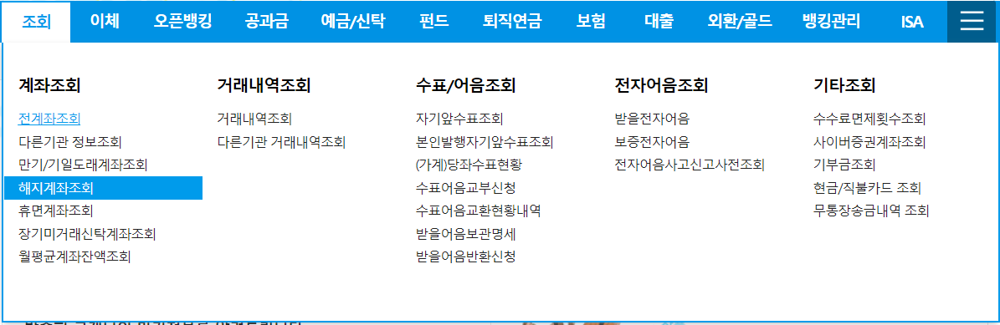
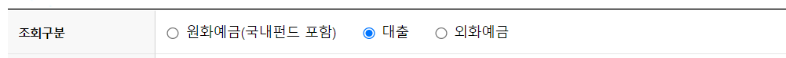
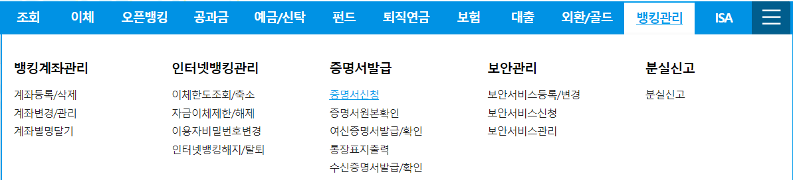

부동산 매매 거래를 할 때, 매도인이 담보대출 건을 당일 말소시키겠단 조건을 보통 넣게 되면 매수인의 대출 실행 은행 측 법무사가 와서 **'상환이 완료됐는지 증명해야 하니까 증명서를 달라'** 고 한다. 증명서요? 상환 다 했는데요??

당황해서 인터넷뱅킹 홈페이지를 여기저기 뒤지고, 영업점에 전화도 해 보고, 그러다보면 시간이 쫓길 수 있다! 우리의 시간은 소중하고 나도 이사 갈 곳에 잔금 치뤄야 하는데 이게 뭐야 ㅠㅠ

그래서 이 참에 정리해 봤다. **우리은행**을 예로 들겠지만, 다 비슷할 거라 생각한다.

### **대출완제 영수증** 발급 받기

대출완제 영수증이란 즉, 대출 상환을 다 마쳤다는 영수증이다.   
'개인 > 조회 > 계좌조회 >  **해지계좌 조회**' 로 들어간다.

조회구분에 '대출' 이 있는데, 이걸 클릭한 다음, 상환이 완료된 날짜가 포함되도록 기간을 설정해 조회하면 끝.

그러면, 대출완제 영수증 출력 버튼과 함께, 해지된 계좌가 나타나게 되는데, 그걸 출력해 법무사에게 건네주면 끝!

### **주택자금대출 상환증명서** 발급 받기

연말정산 용으로 주택담보대출의 이자액을 공제받을 목적이나 기타 목적으로 상환 증명서를 떼야 할 수 있다. 주의할 점은, 이 상환 증명서는 상환한 대출 이력만 나오므로 대출이 전액 상환되었는지 증명할 수 없는 서류라는 점. 

이걸 떼 주면 법무사가 '이거 아니야' 라고 고개를 절레절레... 그러니 대출의 전액 상환을 증명하려면, 앞서 소개한 '대출완제 영수증' 을 발급받아야 하니 주의!

이번에는 '개인 > 뱅킹관리 > 증명서발급 > **증명서신청**' 으로 간다.

그 안에서 주택자금대출상환증명서를 선택한 뒤, 발급 신청을 통해 받을 수 있다.

