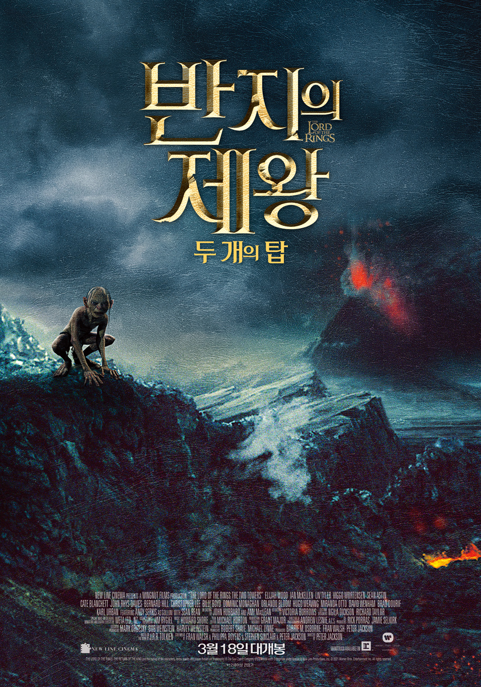
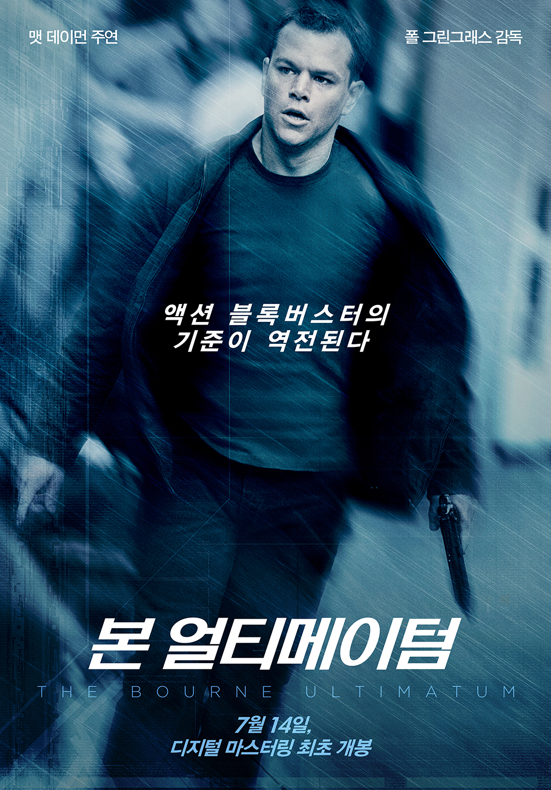
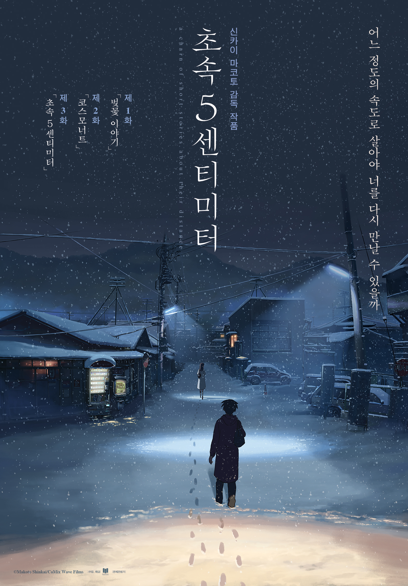
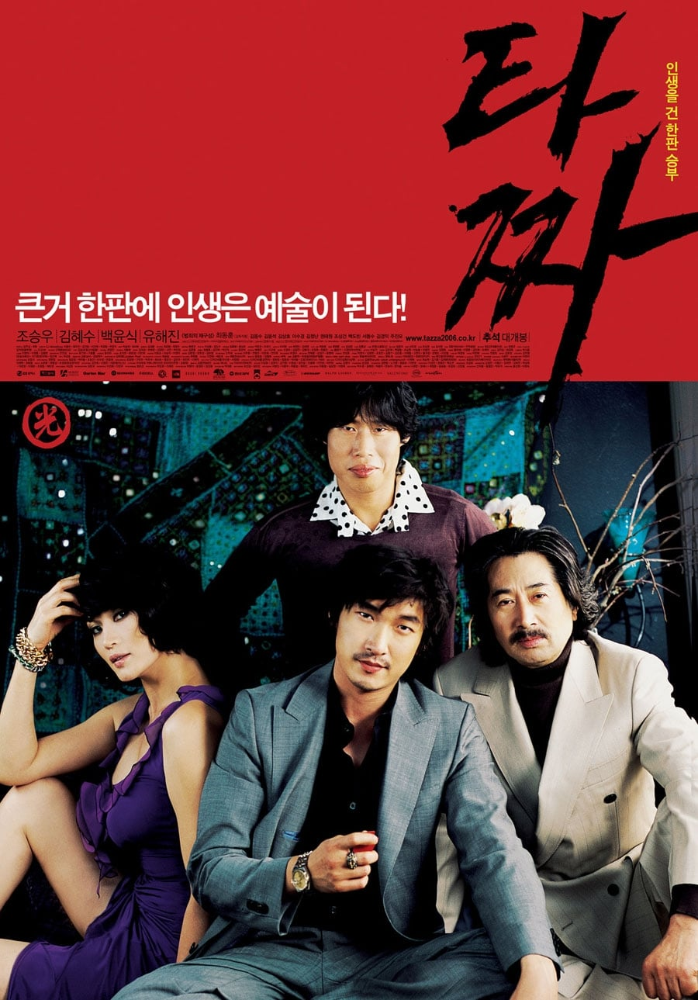

+++
author = "InterP"
categories = ["Essay"]
date = 2022-08-04T18:09:24Z
description = "예술성, 대중성 다 제끼고 내가 제일 즐겨본 영화는?"
draft = true
image = "feature.jpg"
tags = ["영화", "베스트5", "타짜"]
title = "내 인생 영화 BEST 5"
url = "/my-life-best-5-movies/"

+++
> "다섯 번째로 좋아하는 영화가 뭐예요?"

이 질문은 장강명 작가의 '[책 한번 써봅시다](https://www.aladin.co.kr/shop/wproduct.aspx?ItemId=247906273&start=slayer)' 에서, 나의 개성을 알아내는 질문으로 제시된 것 중 하나이다. 여기에 답하려면 가장 좋아하는 영화를 골라내고, 어떤 기준으로 영화의 순위가 갈라지는지 알아야 한다. 이런 질문은 글감을 찾아내기에도 안성 맞춤이라고 한다.

그래서 무턱대고, [왓챠](https://pedia.watcha.com/)에 기록한 내 영화 리스트를 죽 꺼내들어서 별점이 가장 높은 영화 중 5편만 꼽아봤다. 참고로 내 왓챠 평균 별점은 3.9점이다. 후해도 너무 후하다 (...) 물론 철학적으로 사유하기 좋은 영화도 많고, 고전 영화도 심심찮게 많이 봤다. 하지만 어디까지나 개인적인 기준의 BEST5 이니 편한 마음으로 봐주시길.



## 5. [반지의 제왕 : 두 개의 탑](https://movie.naver.com/movie/bi/mi/basic.naver?code=31795) (2002)

이 시리즈의 첫 번째 영화인 '[반지 원정대](https://movie.naver.com/movie/bi/mi/basic.naver?code=31794)' 는 내가 영화관에서 본 두 번째 영화다. (첫 번째는 스티븐 스필버그의 A.I.) 이 계기로 모든 시리즈를 영화관에서 보게 되었는데, 순전히 옛날 추억으로 다섯손가락에 꼽은 것만은 아니다.

시리즈 두 번째 영화인 '두 개의 탑' 은 본격적인 오크의 침공이 그려지기 때문에 스케일 면에서 장엄함을 느낄 수 있다. 지금까지도 이런 전투 스케일을 그려내는 판타지 영화가 없다고 할 정도니까. 그리고 마지막 간달프의 증원은 길이 회자될 만 하다.

하지만 역시 후술할 다른 영화들보다 오래된 영화라 그런지, 추억속에서 건져올릴 만한 것이 없는 영화이기도 하다.

## 4. [본 얼티메이텀](https://movie.naver.com/movie/bi/mi/basic.naver?code=59075) (2007)

개인적으로 본 시리즈를 다 좋아하지만, 세 편 모두 넣을 순 없어서 가장 애정하는 한 편만 넣기로 했다. ~~아, 그 다음에 나온 영화들이요? 그게 뭐였죠? ㅎㅎㅜㅜ~~

대사나 명장면은 1편인 '[본 아이덴티티](https://movie.naver.com/movie/bi/mi/basic.naver?code=35273)' 가 더 많이 떠오르는데, 아무래도 거의 모든 비밀을 알게된 본이 활약하는 세 번째 시리즈가 전체적으로 더 기억에 남는다. 그리고 마지막 엔딩까지 완벽하게!

설정이 무엇보다 매력적이다. 기억을 잃었는데, 알고 보니 내가 킹왕짱 센 특급 비밀 요원?! 옛날 성룡의 영화들에서 볼 수 있는 임기응변 식의 액션이나 탈출 씬이 많아, 덜 작위적면서도 손에 땀을 쥐게 만들었다.

반지의 제왕보다 순위가 높은 점은, 일단 지루하지 않다는 점이다. 반대로, 상위권 영화보다 순위가 낮은 점은, 리플레이성은 확실히 떨어진다는 점이다. (그래도 한 예닐곱번은 본 듯)

## 3. [초속 5센티미터](https://movie.naver.com/movie/bi/mi/basic.naver?code=66820) (2007)

이제부터는 얼마나 영화를 많이 봤느냐에 따라 순위가 매겨진다. 개인적으로 볼 때 마다 감상이 조금씩 달라지는 영화를 매우 좋아하는데, 그러자면 먼저 해석할 여지가 많거나 아니면 어느 한 부분이 특출난 영화여야 한다. ~~재미있는 건, 해석할 여지가 많은 영화들은 TOP5 에 모두 들지 못했다.~~

사실 TOP3 를 뽑으라면 왓챠고 뭐고 보지 않고 이 세 편을 자신있게 꺼낼 수 있었다. 그 중에서 가장 짧은 (!) 초속 5센티미터가 3위이다. 이 영화는 그냥 '예쁘다'.

신카이 마코토 감독의 단편 애니메이션 '[별의 목소리](https://ja.wikipedia.org/wiki/%E3%81%BB%E3%81%97%E3%81%AE%E3%81%93%E3%81%88)' 를 투니버스에서 심야에 방영해 준 적이 있었다. 우연히 보게 되었는데, 인체 비율이 좀 아쉽긴 하지만 배경에서 느껴지는 장인정신에 감탄했다. 괜히 '빛의 마술사' 라고 불리는 게 아니다.

초속 5센티미터는 어릴적의 풋풋함, 싱그러움, 방황, 사랑을 정말로 예쁜 배경에 담아낸 작품이다. 지금 다시 보라고 하면 오글거릴텐데, 당시의 나는 몇 번이고 돌려봤던 기억이 있다. 물론 스토리 자체에는 호불호가 갈릴 수 있지만, 그렇게 찜찜하게 끝내는 게 이루어질 수 없는 첫사랑을 잘 표현했다고 생각한다.

## 2. [라라랜드](https://movie.naver.com/movie/bi/mi/basic.naver?code=134963) (2016)

초속 5센티미터가 철없는 20대 초반에 돌려보기를 했다면, 이번엔 요즘 와이프와 자주 돌려보는 영화 '라라랜드' 가 2위이다. 이 영화는 다들 알다시피 음악에 공을 들였고, 정말로 다시 봐도 좋은 영화임에 틀림없다. 그런데 우리는 돌려볼 때 마다 마지막 장면을 주로 이야기하곤 한다.

결국 세스와 미아는 서로의 꿈을 응원하고 헤어지는데, 마지막에서 우연히 재회한 장면을 '만약에...?' 로 압축된 미니 뮤지컬로 표현하는게 기가 막히고 코가 막힌다. 아쉽게 헤어진 연인에 미련이 남을 때 늘 하는 생각들이 다들 이런 것 아니겠는가. 서로 아련해진 미아와 세스는 마지막 장면에서 눈빛을 주고 받으며 영화는 끝이 난다.

## 1. [타짜](https://movie.naver.com/movie/bi/mi/basic.naver?code=57723) (2006)

"타짜를 아냐구요? 내가 본 영화 중 최고였어요"

와이프와 친구들은 이제 내가 타짜 대사 드립 좀 그만 쳤으면 좋겠다고 한다. 미안하다, 상황만 맞으면 드립을 치고 싶어 입이 근질거린다. 곽철용이 유행을 타기 훨씬 전부터, 거의 모든 대사를 줄줄이 꿰고 있었다. 왜냐고? 대사 하나하나 거를 타선이 없기 때문이다. 나는 타짜가 최동훈 감독의 역작이라고 생각한다. '[전우치](https://movie.naver.com/movie/bi/mi/basic.naver?code=48227)'도 좋아하고 '[암살](https://movie.naver.com/movie/bi/mi/basic.naver?code=121048)' 도 좋아하지만, 아무래도 타짜 뿐이다.

소재가 매력적이기도 하지만, 그것보다는 인물들의 개성에 딱 맞는 대사와 그 합을 아주 오밀조밀 잘 짜뒀기 때문이다. 그래서 이 영화는 지루하지가 않다. 다음 장면이 아 그거였지 싶어도 기대가 된다. 그 환상의 티키타카를 볼 생각을 하면 말이다.

## 마치며

이렇게 모아보니 나는 자주 본 순서대로 순위를 매겼다. 좋아한 만큼 자주 봤을테니 당연한 거 아닌가? 물론 자주 보지 않았음에도 기억에 남는 영화는 많다. 이런 영화를 또 모아서 '아차상!' 같은 포스팅을 하면 좋겠지만, 언제 시간이 될런지. 어쨌거나, 이렇게 나만의 순위를 매겨보고 그 이유를 탐구해보는 시간도 나쁘지 않은 것 같다. 다른 분들도 한번 해 보길 바라며, 다음에는 다른 분야에서 나만의 순위표를 만들어 볼 생각에 벌써 신났다. 감사해요, 장강명 작가님!