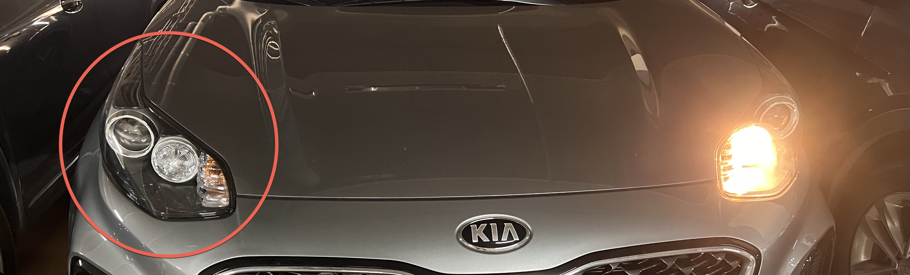
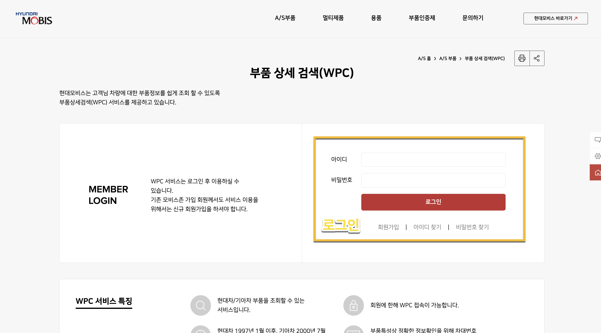
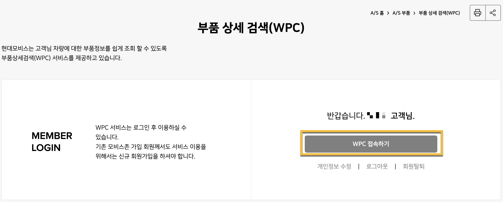
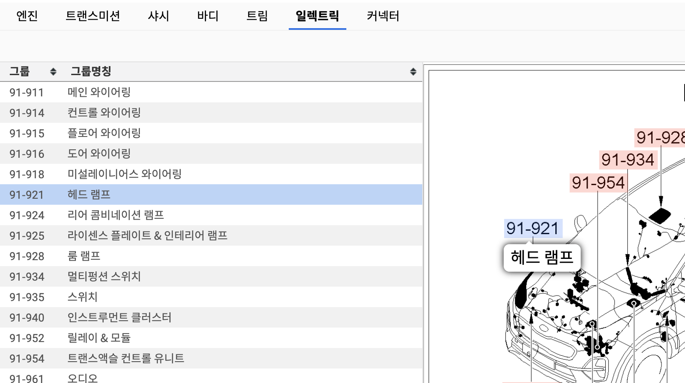
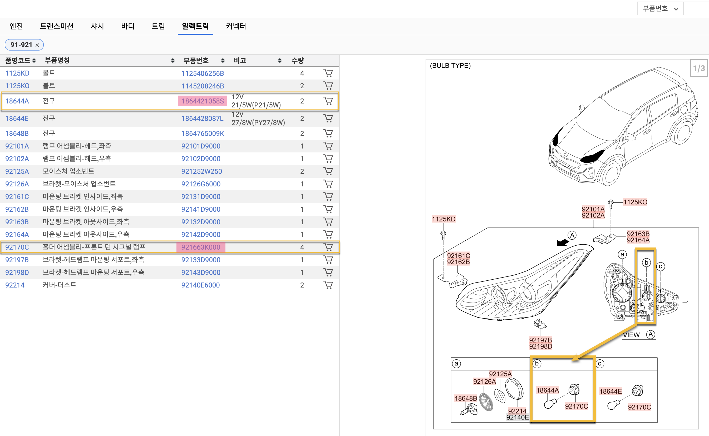
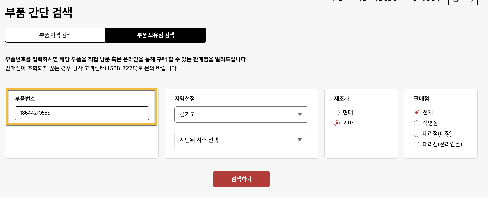

타고 다니는 스포티지에서 오른쪽 주간 주행등이 켜지지 않았다. 공업사에 가면 고쳐줄텐데, 공임비 내는게 아깝기도 하고 전구 하나 갈아끼는데 수리까지 맡길 필요가 있나? 그래서 DIY 로 고쳐 본 기록을 남긴다.

여기서는, 어떻게 고쳤는지 보다 **내 차량에 호환되는 부품을 찾아보는 방법**을 정리해 봤다. 물론 현대/기아 자동차만 가능하다.

# 어떻게 고칠까?

같은 연식은 아니지만, 주간 주행등을 고친 [후기](https://blog.naver.com/PostView.nhn?blogId=dmsrmsdmsrms06&logNo=221385118544&parentCategoryNo=&categoryNo=6&viewDate=&isShowPopularPosts=true&from=search)를 찾을 수 있었다. 

1. 본네트를 연다.
1. 문제가 되는 전구 위치를 찾는다.
1. 해당 위치의 소켓을 반시계방향으로 돌려 빼낸다.
1. 전구를 갈아 끼운 다음, 역으로 다시 소켓을 끼우면 된다. 

# 부품을 알아보자
다행히, 차량에 따라 호환가능한 부품 여부를 쉽게 알 수 있는 사이트가 제공되고 있었다. PC 웹 브라우저에서 [부품 상세 검색 (WPC)](https://www.mobis-as.com/wpc_login_new.do) 웹 페이지에 접속하면 되는데, 처음에 회원가입을 요구한다.

회원가입 시 (1) **연식이 포함된 차종**과 (2) **차대번호**는 반드시 입력해야 한다. 두 정보 모두 자동차 등록증에 나와있다. 완료되었으면, 로그인해서, 아래와 같이 WPC 접속 버튼을 클릭한다.

새 창이 뜨고, 회원가입 시 입력한 차량과 차대번호가 나타나는데 그대로 '확인' 을 누른다.



나의 경우엔 전기부품일 테니까, 일렉트릭 메뉴를 클릭한다. 그러면 상세한 그림이 목록과 같이 나타나는데, 헤드 램프가 가리키는 부분을 눌러도 되고, 해당 부분이 가리키는 코드를 왼쪽 목록에서 찾아서 눌러도 된다.

그러면 헤드 램프에 대한 상세한 그림이 나타난다. 여기 보면 주간 주행등 위치를 나타내는 (b) 그림을 참고해서 **품명코드**를 찾고, 왼쪽 코드에서 **부품번호**를 찾으면 된다.

내가 필요한 건 두 가지인데, 주간 주행등의 전구가 문제인지 소켓이 문제인지 알 수가 없었기 때문에 둘 다 구매할 생각이었다.

- *1864421058S* 전구 (4,400원)
- *921663K000* 소켓 (1,600원)

# 부품을 사러가자

부품번호를 가지고 온라인몰에서 구매해도 되지만 배송비도 들고 어쩐지 부품 원가보다 훨씬 비싸게 받는 사이트가 많아서, 가까운 오프라인 매장이 있을까 해서 찾아봤었다. 다행히 차로 10분 거리에 현대 모비스 부품 매장이 두 군데나 있었다!

[부품 보유점 검색](https://www.mobis-as.com/simple_search_inventory.do) 에서 부품번호를 입력한 뒤 검색하면, 가까운 보유점을 찾을 수 있다.

**방문 전에 반드시 전화로 재고 여부를 한번 더 확인하는 것이 중요하다.** 실시간으로 재고 반영이 되질 않아서, 누군가가 먼저 구매해 버렸을 수도 있기 때문이다. 전화를 미리 해 두면, 부품을 빼 두기 때문에 헛걸음할 가능성을 없앨 수 있다.
