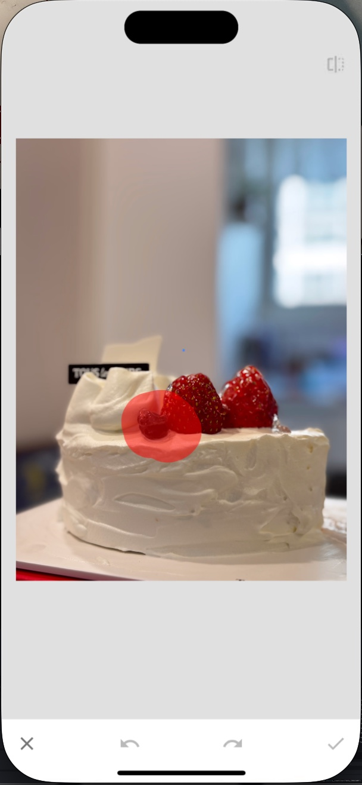

책 리뷰를 쓰기 전에, 거의 1년 넘게 리뷰를 쓰지 않았다는 사실이 충격적이다. 작년보다 책은 더 많이 읽었는데, 오히려 '이거 써서 뭐하나, 누가 읽어주는 것도 아니고' 같은 생각이 머리를 지배하고 있었던 것 같다. 문득 블로그를 하는 이유에 대해 진지하게 고민했는데, 늘 같은 결론에 도달하게 되었다. _'쌓아가는 습관' 을 들이고 그것을 증명할 수 있는 수단으로써 블로그를 하는 것이다_, 라고. 

그래서, 최근에 읽었던 것 중 가장 가볍게 읽었고 '각 잡고' 배우려 하거나 머리를 싸매지 않았던 매우 즐거운 책을 한 권 골라 쓰려고 한다. 스마트폰으로 사진을 찍는 방법에 관한 책, ['오늘도 스마트폰으로 인생사진을 찍습니다'](https://www.yes24.com/Product/Goods/120257426) 이다.

사진을 보면 알겠지만, 도서관에서 대출한 책이다. IT와 가까운 책들은 언제나 출판년도에 민감할 수 밖에 없고, 이 책은 2023년 8월에 출간되어 도서관 안에서 '스마트폰 사진 촬영' 분야에서는 가장 막내였다. '사진 촬영' 분야로 가면 다른 유망주가 있을 순 있겠으나, 보통은 에세이거나 이론에 빠삭하기만 한 친구들이었기에, '가볍게 읽을 수 있으면서 유익한' 이 책에 손이 가게 되었다.

책의 구성은 크게 2가지로 나뉘는데, 사진을 어떻게 찍는가와 사진을 찍고 나서의 보정법에 대한 것이다. 

# 사진을 찍는 방법

들어서면 스마트폰 카메라 그립을 아주 친절히 설명해주고, 그 다음 아주 기초적인 팁 두 가지를 알려준다. 

1. 세로로 찍을 때는 카메라가 아래로 오도록 뒤집어서 찍는다. 
2. 렌즈를 항상 잘 닦아라!

카메라가 보는 각도와 사람이 보는 각도가 달라서, 그 구도를 맞추는 연습을 많이 해 둬야 한다고 한다. 안 그러면 보정으로는 도저히 잡을 수 없는 공간의 뒤틀림을 만들어낼 수 있다. **결국 연습인가 보다**. 스마트폰은 크게 아이폰 또는 안드로이드일텐데, 두 OS 모두에 대한 카메라 설정 팁을 알려주는 게 매우 좋았다. 어떤 건 꺼 두는게 좋고, 어떤 건 화면에 나타내면 좋고 이런 것들 말이다. 2023년 기준이면 iPhone 14 Pro 와 Galaxy S23 Ultra 를 기준으로 설명하니까, 지금 시점에서도 나름 최신(?) 인 셈.



스마트폰 촬영 관련 다양한 웹페이지에서 알려주는 ['격자 활용하기'](https://www.banronbodo.com/news/articleView.html?idxno=22994) 내용이 여기서도 나온다. 수평/수직을 맞출 때 필요한 격자선에서, 격자점 구도나 2:1 구도 등의 내용이 이어진다. 이것도 물론 연습이 필요하겠다! 태양을 피하지만 말고, 언제 찍어야 사진이 잘 나오는지도 짧게 설명하고 있다. 야경은 깜깜한 밤 말고 해 지고 난 직후!

책 전반적으로, 피사체 하나가 아닌 _피사체와 어울리는 것들을 곁들이는데 공을 들이라_ 는 암묵적인 조언이 퍼져있었다. 스마트폰으로 카페 사진을 많이들 찍을텐데, 커피만 찍지 말고 근처 소품을 곁들이거나 디자인이 담긴 명함이나 코스터를 옆에 두고 찍어보라고 조언한다. 제품을 그냥 맨바닥에 찍지 말고 침대 이불이나 식탁보를 써서 배경을 재밌게 만드는 방법도 소개하고, 보딩 패스를 찍고 싶다면 여행용 아이템을 곁들이는 방법 등등에서 이런 메시지가 들어가 있었다. 

# 사진을 보정하는 방법

여기서는 딱 하나의 앱만 소개한다. 바로 **[Snapseed](https://play.google.com/store/apps/details?id=com.niksoftware.snapseed&hl=ko)**! 구글에서 만든 사진 편집 앱으로, 무료임에도 불구하고 매우 강력한 편집 기능을 제공한다. 하지만 다른 앱에 비하면 직관적이진 않은 인터페이스 때문에 '이게 뭐시여' 하고 넘어갔을 수 있다. 이 책에서 말하는 대로만 따라해 보니, 꽤 자유도 높은 사진 보정을 할 수 있었다.

이 책을 읽고 처음 알게 되었는데, 갤럭시의 _AI 지우개_ 처럼 사진의 잡티 (또는 걸리적거리는 피사체) 를 없애는 '**잡티 제거**' 기능이 있다! 물론 피사체가 충분히 작아서 지워도 괜찮을 때만 효과적이고, 당연히 AI 보정을 해주는 갤럭시 지우개가 훨씬 더 좋기는 하지만 만만하게 쓰기에는 괜찮은 기능이었다. 

그 밖에도 **'화사한 글로우'** 로 소위 '뽀샤시' 한 사진을 만들거나 **'거친 필름'** 으로 옛날 사진 효과를 낸다거나, **'빈티지'** 로 비네트 효과를 줄 수 있는 방법을 소개한다. 그저 스타일 탭에서 몇개 골라서 누르는게 아니라, 내가 원하는 효과들을 쌓아서 다른 사진들엔 한번에 적용할 수 있는 스타일을 직접 만들 수도 있는 것이다! 

한 가지 아쉬운 점은, 책에서 제공하는 네 가지 스타일을 다운로드 할 수는 없었다. 스타일을 공유할 수 있는 snapseed.com 사이트가 더 이상 운영하지 않는 것 처럼 보였기 때문이다. 🥲

# 스마트폰 카메라가 가지는 강력함

내 첫 카메라는 이름모를 똑딱이 카메라였다 (정말 이름을 모르겠다.. 고등학교 때부터 썼는데!). 그 다음에는 삼성케녹스의 [X85](https://prod.danawa.com/info/?pcode=142494), 똑딱이를 탈피한 세 번째는 소니 최초의 DSLT 로 광고하던 [a55](https://prod.danawa.com/info/?pcode=1167754) 를 썼었고, 마지막이자 현재까지는 감성 카메라로 쳐주던 후지필름 [X100F](https://prod.danawa.com/info/?pcode=5137185) 를 남기게 되었다. 

하지만 X100F 가 나가는 일이 점점 줄어들고 있다. 내 iPhone 15 와, 와이프의 갤럭시 S23 으로 그냥저냥 찍어대고 있다. 센서 크기에서 차이가 난다는 것, 그래서 X100F 로 찍은 결과물이 월등히 좋은 것, 물론 안다. 하지만 인화할 게 아니고 인스타로 소비될 거라면, 오히려 구도 잘 잡고 보정 잘 하는 것이 더 효율적이지 않을까? 게다가, (이건 X100 시리즈의 문제기도 한데) 스마트폰으로 촬영하면 GPS 동기화도 잘 되니 어디서 언제 찍었는지 지오태깅할 때 화딱지 날 일도 없다. 클라우드 동기화는 또 얼마나 잘 되는지! 점점 스마트폰 카메라가 대세가 되니, 이런 책의 도움을 받는 것도 나쁘지 않다고 생각한다. 😍

