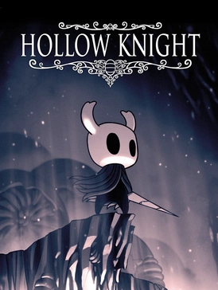

XBOX PC 게임 패스를 결재한지 2개월차가 되는 어느 날. 프로스트 펑크 2를 하던 중에 한 게임을 발견했다. 이건 뭐지? 음? [대만 게임사?](https://shop.redcandlegames.com/ko-KR) 반교, 환원이라는 공포 게임을 만들었다고? 데드 스페이스 이후로 공포게임은 안 해봤는데. ~~바이오하자드4 리메이크는 액션 게임이고~~ 

그런데 트레일러가 공포 게임이 아닌데? 횡스크롤.. 맵.. 보스전.. 죽으면 영혼을 떨궈? 이거 마치...!!



## 익숙한 할로우 나이트의 향기

**할로우 나이트**는 귀여운 캐릭터와 아기자기한 (!) 그래픽, 밀도있는 맵 구조로 메트로배니아 유저들을 만족시킨 '옛날' 게임이다. 진 보스를 잡은 기억이 아직도 새록새록 떠오르는데, 2017년 출시니까 벌써 8년 전이다. 

팬들은 후속작인 **할로우 나이트: 실크송**의 출시를 목빠져라 기다리고 있는데, 2022년에 나온 트레일러가 최신 정보일 정도로 뭐가 없다. 올해는 나올런지 어쩔런지, 올해 출시를 발표한 닌텐도 스위치2 의 독점작이 되는게 아닌가 하는 루머까지 있다. 뭐, 아래 트레일러처럼 게임패스 데이원 출시라고 하니, 일단 믿어보자.



이 게임의 주인공 '예' 역시 뾰족한 귀를 가진 수인처럼 보이기 때문에, 할로우 나이트의 주인공 '기사' 와 비교될 수 밖에 없다. ~~기사는 종족이 뭘까~~ 공격 모션도 비슷하고, 인트로에서 떨어지는 이벤트도 비슷해서 더욱 그런 것 같다. 실크송을 기다리다 지친 와중에 본 트레일러가 궁금해서 건드려봤는데, 확실히 더욱 몰입해서 했던 것 같다. 

## 전투는 소울라이크에 가까운

정확히는 소울라이크 중에서도 패링으로 밥먹고 사는 세키로에 가까운 전투 방식을 선택했다. 반대로 말하면, **패링을 못 하면 아~무것도 못한다**. 그래서 제작진이 스토리를 즐기시라고 이지 모드 (=스토리모드) 를 만들 정도이니까. (대신 일반 모드 엔딩 도전과제는 존재한다)



할로우 나이트의 전투가 회피와 딜타임 캐치로 이뤄진 것과는 대조된다. 다양한 패턴을 숙지하고 탄막을 솜씨좋게 피한 다음, 칼을 언제 휘두르고 언제 회복해야 하는지를 정확히 파악해야 했으니까. 하지만 여기서는 오히려 피하기만 할 수가 없고, 정말 세키로처럼 패턴에 맞춰 패링을 하는, 소위 '박자 맞추기' 가 강제된다. 

그렇다고 마냥 공격을 막는 것만 있느냐. 초반에는 가드 불가 공격이 나오고, 그 중 일부는 공중 밟기로 캔슬이 가능한 공격이 있고, 중반에는 이 가드 불가 공격도 튕겨내는 기술을 배우게 된다. 결국 나중에는 패링조차 삼지선다형 문제로 출제된다는 것이다. 그리고 패링을 할 수 없을 땐 대쉬 회피까지 해야 하니 실제로는 선택지가 더 늘어나게 된다. 정답은 하나 뿐. 

데미지를 넣는 것도 여러 가지가 있다. 피해는 기본적인 체력피해와 더불어 시간이 지나면 회복이 가능한 내상으로 구분되는데, 내상이 아무리 많아도 실제론 죽지 않는다. (그것은 주인공도 마찬가지다) 대신 내상을 모두 피해로 바꾸려면 **부적을 붙여** 터뜨려야 한다. 보스전에서는 부적 플레이가 강제되는데, 붙이고 나서 터뜨릴 떄 까지의 딜레이 관리를 하지 않으면 흠씬 두들겨 맞고 취소된다.



그래서 회피일변도로 진행하는 할로우 나이트보다 훨씬 조작이 복잡하게 느껴진다. 복잡한 만큼 다양한 패턴을 경험할 수 있고 더욱 박진감이 넘칠 수도 있으니 이것이 특장점이라고 생각하지만... 이런 류의 게임을 접해보지 않은 초심자들에게는 엄청난 진입장벽으로 느껴질 수 밖에 없다.

## 더욱 풍부한 서사, 그리고 무위사상

할로우 나이트는 엔딩을 보고 나서도 뭔가 와닿는 메시지가 없었다. 그래서 기사는 왜 그런 선택을 하게 된 건지, 기사의 기원은 무엇인지 심연은 어떤 곳인지 등등..

나인 솔즈도 초반부는 썩 친절하진 않다. 주인공은 인간들과 다르게 생겼는데, 이 인간들이 믿는 신은 주인공과 비슷해 보인다. 진행하다 보면 과학인지 도술인지 모를 세상이 소개된다. 황혼 파수꾼은 누구들이고, 이 곳들은 다 뭐지? 이 모든 파편들은, 마치 조각난 보스들의 기억이 맞춰지듯이, 최후반부에 가서야 모두 들어맞게 된다. 

그렇게 엔딩을 보고 나면, 조금 뻔해 보이기도 한다. 하지만 여기에는 동양에서 흔히 접할 수 있는 **도교적 사상**이 반영되어 있다고 한다.



도교의 핵심 사상은 '_무위지치(無爲而治)_', 아무것도 하지 않음으로써 다스린다는 것이다. 헌데 주인공은 오히려 뭔가를 힘써서 바꿀 수 있다고 믿는다. 모든 여정과 전투가 그렇다. 세계관에서 무위사상을 설파한 옛 현인을 만나기도 하지만, 주인공의 의지는 꺾이지 않는다. 과연 그게 정답일까? 

게임은 주인공에게, 플레이어에게 질문한다. 

> 거스를 수 없는 운명을 받아들이는 것은 의미가 없는가?   
> 운명에 맞서기 위해 노력하는 것은 과연 의미가 있는가?

## 종합해보면 

개인적으로 할로우 나이트를 여러모로 뛰어넘은 게임이라고 생각한다. (어쩌면 내 생각과 비슷해서 좋다고 느낄만한) 스토리와 교훈도 있고, 액션도 훨씬 어렵지만 되려 성취감이 있었고, 그만큼 깊게 몰입할 수 있었던 것 같다. 마지막 크레딧 롤과 함께 하는 엔딩 OST 도 감상에 젖어 볼 수 있을 정도로 훌륭했다.

다만, 액션의 진입장벽이 꽤나 높은 점, 게임 경고문구에도 나오는 잔인한 표현이 많다는 점 (그래서 일부러 수인으로 바꿔서 거부감을 낮췄다고 카더라), 일본 번역팀이 함꼐 번역해서인지 망쳐놓은 한국어 번역 퀄리티 문제는 걸림돌이 될 수 있겠다. 

---

그런데, 지금 XBOX PC Game Pass 가 [1,500 원에 2달을 즐길 수 있다!](https://www.xbox.com/ko-KR/xbox-game-pass#join) 2025년 2월 초까지라고 들었는데, 그 전에 가입만 한다면 나인 솔즈 엔딩은 충분히 볼 수 있을 것이다..!


