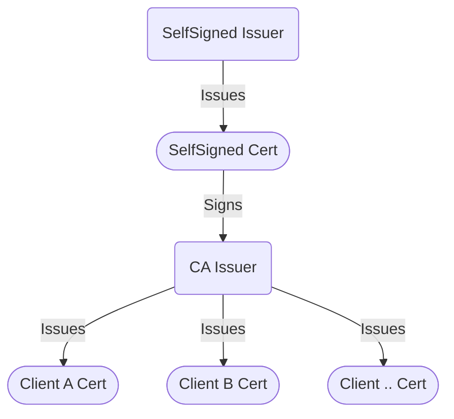

이번에는 기술 트렌드는 아니지만, K8s 에서 늘 존재하는 cert-manager 에 대한 소개와 함께, 클러스터 안에서 가장 많이 사용되는 패턴인 SelfSigned Certificate 를 이용한 보안 관리를 설명해 보려고 하다.

Kubernetes 가 아무래도 논리적인 클러스터링이기 때문에, 물리적으로 전송되는 패킷들을 암호화해야 하는 보안 문제가 늘 존재하다. 그래서 조직에서는 서비스 간 통신에도 암호화를 꼭 해달라는 요구사항이 있는데요. (물론 제가 몸담고 있는 곳도 마찬가지입니다) 

다행히 (?) Kubernetes 에서는 클러스터 안에서 직접 이 X.509 인증서를 관리할 수 있는 Operator 와 Custom Resource 를 제공하다. 바로 cert-manager 입니다. 

> 혹시 X.509 인증서가 뭐야? 라고 생각하신다면.. [이 블로그](https://gruuuuu.github.io/security/what-is-x509/)가 가장 쉽게 알려주는 것 같아요. 한번 읽어보시길 권장드립니다.

# Issuers/Certificate CR

핵심이 되는 Custom Resource 는 `Issuer` 와 `Certificate` 입니다. 

- `Issuer` 는 **실제 발급자와 연결되는 정보**를 담고 있습니다. ACME 와 함께 다양한 Cloud Provider 의 내장 CA 와도 연결이 가능하고요. 자체적으로는 [SelfSigned](https://cert-manager.io/docs/configuration/selfsigned/) (자기가 그냥 사인하는 경우), [CA](https://cert-manager.io/docs/configuration/ca/) (특정 Root Certificate 를 두는 경우) [Vault](https://cert-manager.io/docs/configuration/vault/) (Hashicorp Vault 서비스에 요청해서 발급하는 경우) 가 대표적입니다.
- `Certificate` 는 Issuer 를 통해 발급하는 인증서 관련 정보를 담고 있습니다. CommonName 으로 시작하는 *Distinguished Name (DN)* 정보와 함께, 인증서의 만료기간을 제어하는 다양한 attribute 가 있습니다.

간단히 말씀드리면, Issuer CR 을 만들고 Certificate CR 을 만들면 cert-manager operator 가 작동해서 Certificate CR 에 맞는 Secret 리소스가 하나 생성됩니다. 그러면 Certificate CR 의 상태가 Ready 가 됩니다 (Issuer 에 문제가 있으면 Secret 도 없고, Ready 도 되지 않습니다)

# SelfSigned Certificate

가장 간단한 형태는 SelfSigned 입니다. 자기가 사인한 인증서로 다른 인증서를 발급하는 구조이죠. 

그런데 자기가 사인한 인증서를 발급받는 부분이 한 단계 더 필요하다. SelfSigned Issuer 를 만들고, 거기서 SelfSigned Certificate 를 만들어야 하다. 여기서 출발하는 것이죠. (그림에서 CA Issuer 전까지를 나타냅니다)

이 부분을 cert-manager 에서는 [Bootstrapping CA Issuer](https://cert-manager.io/docs/configuration/selfsigned/#bootstrapping-ca-issuers) 라는 섹션에 정리했습니다.

그런데 왜 이렇게 한 단계를 더 두는 걸까요? SelfSigned Issuer 만으로 Client Certificate 를 만들면 안 될까요?

그렇게 하면 발급해 준 (Signing) Certificate 가 매번 변하다. 그래서 모든 Client Certificate 에 대한 Root Certificate 가 특정되지 않은 상황이죠. X.509 에서는 동일한 Root Certificate 를 가지고 복호화가 가능한 모델이어야 하는데, 그럴 수가 없습니다.

아무튼, 이렇게 하면 클러스터 안에 상주하는 서비스들 입장에서는 동일한 Root Certificate (**SelfSigned Cert**) 에서 사인받은 인증서를 가지고 통신하면 안전하다. 그리고, 이 Certificate 의 내용이 저장되는 Secret 은 클러스터 바깥에 나갈 필요가 없기 때문에 (바깥에서 사인해 줄 이유가 없으니) 보안 상 이슈가 없기는.. 하다. (혹시 틀렸다면 알려달라!)
