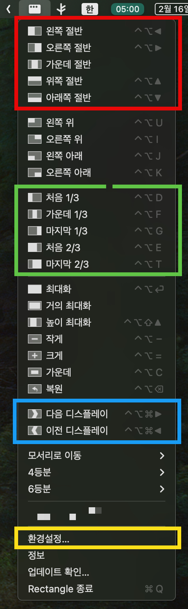

대학 다닐 때부터 듀얼 모니터를 썼고, 모니터 간 창 이동 기능을 위해 여러 프로그램을 썼던 기억이 있다. ~~뭔지는 정확히 기억이 안 난다~~ 

Windows 7 부터는 운영체제에서 기본으로 제공되었는데, 바로 윈도우 키와 방향키 조합이다. [쿨앤조이 게시글](https://coolenjoy.net/bbs/37/220952) 에서도 잘 정리되어 있지만, 내가 창 이동할 때 가장 많이 쓰는 단축키는 사실 이 4개이다.

| 단축키 | 설명 |
| -------- | ---- |
| `Win키 + 왼쪽/오른쪽` | 현재 모니터에서 창을 왼쪽 (또는 오른쪽) 절반만큼 조정 |
| `Win키 + 위쪽` | 창을 최대화 |
| `Win키 + 아래쪽` | 창을 최소화 |
| `Win키 + Shift + 왼쪽/오른쪽` | 창이 위치한 모니터에서 다음 (또는 이전) 모니터로 창을 이동 |

2년 전에 MacOS 를 영접하고 나서 두려웠던 것이, 이런 창 이동 기능이 기본적으로 제공되지 않았다는 것이다. 찾아보니 [Magnet](https://apps.apple.com/kr/app/magnet/id441258766?mt=12), [BetterSnapTool](https://apps.apple.com/kr/app/bettersnaptool/id417375580?mt=12) 이라는 프로그램이 있긴 했지만, 모두 유료였다. 그냥 단축키 몇 개만 바랄 뿐인데 돈을 받는다고...?

그러던 중, 공짜이면서 내가 딱 원하는 기능만 갖춘 무료 앱을 찾았다. 바로 [Rectangle](https://rectangleapp.com/) 되시겠다.

# 설치

다른 두 앱과는 달리, 이 앱은 인터넷에서 다운로드 받아 설치해야 한다. 간혹 이런 메시지를 발견하게 되면, 우선은 MacOS 의 기능을 끄고 나서 설치를 시도해 보자. 



Rectangle 의 가장자리 기능이 마음에 안 들면, 뒤따라 나오는 메시지처럼 '_시스템 설정 → 데스크탑 및 Dock → 윈도우_' 에서 다시 켜주면 된다. (Rectangle 설정에서는 '_드래그하여 창 배치_' 기능을 끄고!)

# 사용법과 단축키

설치한 후에 Mac 의 메뉴 막대 (Windows 로 치면 작업 표시줄) 에 상태 아이콘 (트레이 아이콘) 이 생긴다. Mac 에서의 창 모양처럼 왼쪽 위에 구멍이 세개 나 있는 그 친구 말이다! 클릭해 보면 아래와 같이 장황한 메뉴가 나온다.

빨간색이나 초록색, 파란색 박스가 자주 쓰게 될 기능이다. 물론 단축키로 말이다! 기본적으로 쓰이는 단축키를 정리해 보면 다음과 같다.

| 단축키 | 설명 |
| -------- | ---- |
| `Control + Option + 왼쪽/오른쪽` | 창을 왼쪽 (또는 오른쪽) 절반만큼 |
| `Control + Option + 위쪽/아래쪽` | 창을 위쪽 (또는 아래쪽) 절반만큼 |
| `Control + Option + D` | 창을 3분할해서 가장 왼쪽 |
| `Control + Option + F` | 창을 3분할해서 중간에 |
| `Control + Option + G` | 창을 3분할해서 가장 오른쪽에 |
| `Control + Option + E` | 창을 3분할해서 왼쪽 2/3 만큼 |
| `Control + Option + T` | 창을 3분할해서 오른쪽 2/3 만큼 |
| `Control + Option + Enter` | 창을 최대화 |
| `Control + Option + Command + 왼쪽/오른쪽` | 창을 다음 (또는 이전) 모니터로 이동 |

## 기본 단축키
Windows 는 윈도우 키만 누르면 되는데, 여기서는 키를 3개나 눌러야 한다. 하지만 적응하고 나면 그렇게 불편하지 않다.

잘 와닿지 않는다면, 키보드 아래를 내려다 보자. 스페이스 바 왼쪽에 (Fn/언어 키를 제외하고) 왼쪽부터 Control, Option, Command 가 있다. 이 세 개 중 가장 자주 쓰이는 Command 를 제외한 나머지 키 2개를 나란히 누르고, 화살표로 창을 이동하면 된다.

Windows 와 다른 점은, 위쪽/아래쪽 화살표와의 조합이다. 창 최소화/최대화가 아닌 창 위쪽/아래쪽 이동이다. 이렇게 쓸 일이 얼마나 많을지 모르겠고 가능하면 통일시키고 싶어서, 이 단축키는 따로 설정에서 창 최소화/최대화로 바꿔놨다!

## 화면 3분할
화살표가 아닌 DFG / ET 를 누르는 경우는 조금 감이 안 올 수도 있지만, 와이드 모니터를 사용할 때는 더욱 효과적인 단축키이므로 같이 알아두면 편리하다. 그림에서처럼 매우 친절하게 '_창이 이렇게 움직입나다요_' 를 표시하기 때문에 감을 잡기는 쉬울 것이다. 

키보드를 내려다 보면, 한 줄에 나란히 있는 D, F, G 키가 1/3 씩의 크기를 나타내고, 왼쪽/오른쪽 1/3 을 나타내는 D, G키 바로 위에 있는 E, T키가 왼쪽/오른쪽 2/3 씩의 크기를 나타낸다. 몇 번 하다보면 금새 와이드 모니터에서 넓게 봤다 좁게 봤다를 할 수 있을 것이다.

## 창을 최대화
기본 단축키 기준으로 Control + Option + Enter 를 누르면 창이 최대화된다. 주의할 점은, Mac 에서의 창 최대화 버튼 (초록색) 이 창을 전체화면으로 만들어주는 것과는 다르게 현재 데스크톱 화면에서만 최대화된다.

현재 Windows 도 Mac 도 모두 지원하는 멀티 데스크톱 기능과 관련이 있다. 이건 나중에 따로 다루면 좋겠지만, 아무튼 창 최대화가 Mac 의 것과 다르단 것만 알면 되고.. 정 궁금하면 직접 확인해보면 좋겠다.

## 모니터 이동
이번에는 아예 Command 까지 전부 누르고 왼쪽/오른쪽 화살표를 누르면 모니터간 이동이 가능하다. 

# 설정



사실 '로그인 시 실행' 부분만 체크가 잘 되어 있는지 확인하면 설정을 굳이 건드리진 않았다. 단축키 변경은 상단 메뉴 아이콘 중에서 가장 왼쪽을 선택하면 바꿀 수 있다.

또 한가지 설명해야 할 부분이 '커맨드 반복 입력시' 라는 선택 창이다. 기본값은 '인접한 왼쪽 또는 오른쪽 디스플레이로 이동' 이다. 이게 `Control + Option + Command + 화살표` 기능이 아니라, 똑같이 화면 분할을 해 두고 반복적으로 이동한다는 뜻이다.

예를 들어, 듀얼 모니터를 쓰는 환경에서 모니터1에 `Control + Option + 왼쪽 화살표` 를 입력해서 창을 왼쪽 절반으로 보냈다고 하자. 똑같은 단축키를 입력하면 어떻게 될까?

1. 모니터2의 왼쪽
2. **모니터2의 오른쪽**

정답은 2번이다. 모니터1의 왼쪽에서 더 왼쪽으로 간다면, 모니터2의 오른쪽으로 **밀려나갔다**고 이해하면 편하다. 재미있는 건 3분할에서는 모니터 이동이 되지 않는다. 이건 설명과 다르니까 버그라고 봐야 할지 의도적인 건지 모르겠다.

---

무료 앱이면서 윈도우 창 이동의 거의 모든 기능을 제공하는 Rectangle. 물론 유료 앱들이 더 많은 기능을 제공할 수 있겠지만, 내가 필요한 것은 이 정도면 충분하다!
